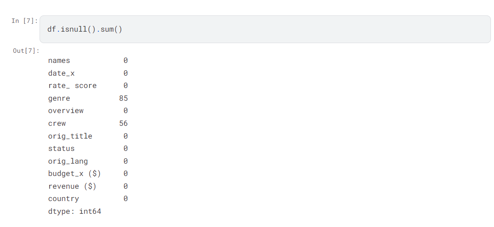
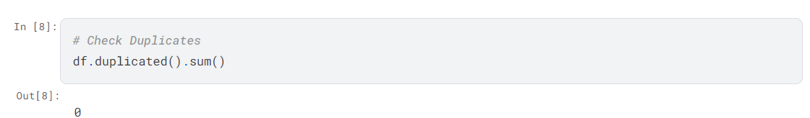
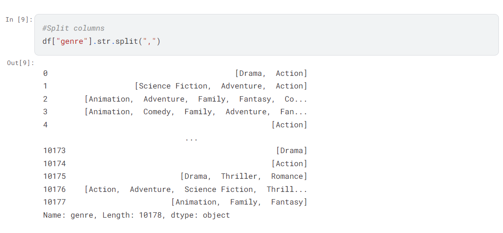
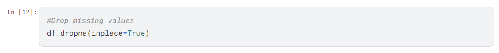
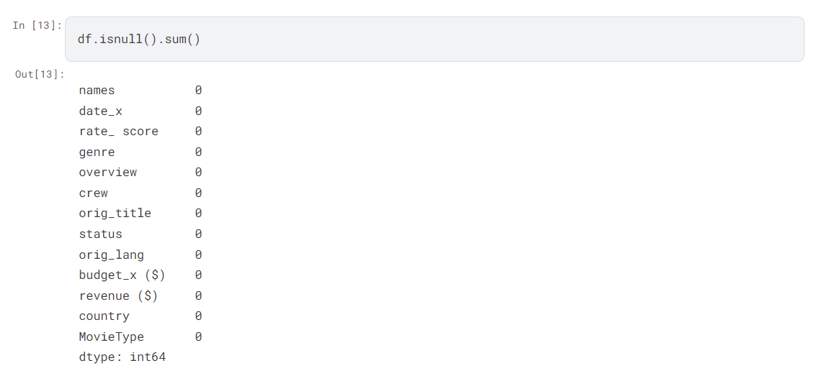

# Movies-Dataset-analysis-EDA-in-Python
## Introduction 
The Chief Financial Officer (CFO) of Amazing Movie Studio seeks to secure $100 Billion in funding from an investor to finance their upcoming movie project slated for release in 2025. To ensure optimal return on investment, the CFO aims to strategically allocate resources towards movie genres, production countries, and budget allocation that are most likely to yield substantial revenue.

In order to make informed decisions, the CFO plans to conduct a comprehensive data analysis of the studio's historical movie data. By leveraging insights from past performances, the CFO aims to identify lucrative opportunities and mitigate risks associated with the new project.

The analysis will focus on exploring correlations and trends within the dataset.

## Problem Statement
Is there a correlation between factors like budget and ratings? Do higher-budget productions tend to receive higher ratings?

How does budget allocation impact revenue generation?

How does Rate score allocation impact revenue generation?

What are the top 10 countries that generate the highest revenue?

Which language generates the highest revenue?

What genre is most popular among viewers?

## Data Dictionary
• names: The names of the movies (titles).

• date_x: The date associated with the movie (release date or another relevant date).

• rate_ score: The IMDb rating of the movie.The Metascore rating of the movie.

• genre: The genre(s) of the movie (e.g., Drama, Action, Comedy, etc.).

• overview: A brief overview or summary of the movie's plot.

• crew: Information about the movie's crew (directors, writers, producers, etc.).

• orig_title: The original title of the movie (if different from the title).

• status: The current status of the movie (e.g., released, in production, canceled).

• orig_lang: The original language of the movie.

• budget_x: The estimated budget of the movie.

• revenue: The revenue earned by the movie.

• country: The country where the movie was produced or originated from.

### Importing Libraries:

## Data Cleaning
### Missing Values Check 

### Check Duplicates 

### Split Genre Column 

### Drop Missing Values 

### Checking Null Values 

